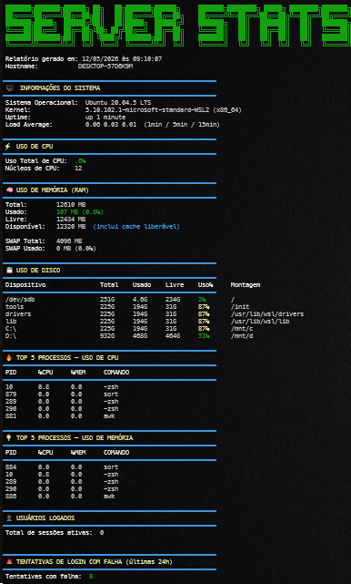

# Server Performance Stats

A Bash script to analyse basic Linux server performance stats.

This project is part of my DevOps learning journey, following the roadmap.sh DevOps path.

- Roadmap.sh project: https://roadmap.sh/projects/server-stats
- Level: Beginner
- Main topics: Linux, Bash, Shell Scripting, Server Performance, Troubleshooting

## Goal

The goal of this project is to create a script called `server-stats.sh` that can be executed on a Linux server to collect basic performance and system health information.

This kind of script is useful during the first analysis of a slow or unstable server, especially in support, infrastructure, cloud, and DevOps environments.

## Requirements from roadmap.sh

The original roadmap.sh project asks for a script that shows:

- Total CPU usage
- Total memory usage, including free vs used and percentage
- Total disk usage, including free vs used and percentage
- Top 5 processes by CPU usage
- Top 5 processes by memory usage

Stretch goals:

- OS version
- Uptime
- Load average
- Logged-in users
- Failed login attempts

## Implemented features

This script currently shows:

- Hostname
- Report generation date and time
- Operating system information
- Kernel version
- System architecture
- Uptime
- Load average
- Total CPU usage
- Number of CPU cores
- Memory usage
- Swap usage
- Disk usage by filesystem
- Top 5 processes by CPU usage
- Top 5 processes by memory usage
- Logged-in users
- Failed login attempts in the last 24 hours
- Basic color highlighting for easier reading

## Technologies used

- Bash
- Linux CLI
- `top`
- `free`
- `df`
- `ps`
- `awk`
- `grep`
- `sort`
- `who`
- `journalctl`
- `/proc/loadavg`
- `/etc/os-release`

## Project structure

```text
server-stats/
├── README.md
└── server-stats.sh
```

## Screenshot

Below is an example of the report generated by the script:

<p align="center">
  
</p>